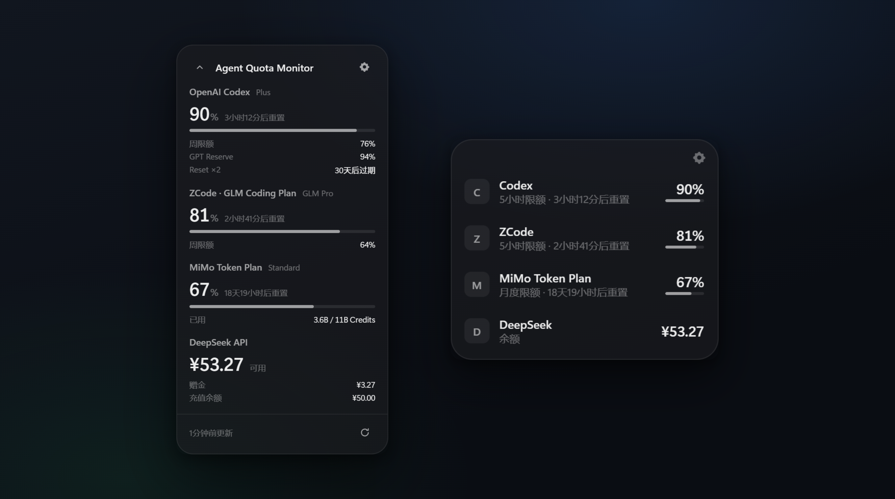

<div align="center">

# Agent Quota Monitor

**完全开源 · Local First 的 Windows 桌面浮窗，实时监控你的 AI 订阅额度与积分**

Codex（ChatGPT）· MiMo Token Plan · WorkBuddy Credits · DeepSeek · ZCode·GLM Coding Plan

**A fully open source, Local First Windows desktop widget that monitors your AI subscription quotas and credits in real time.**

[](LICENSE)
[](https://github.com/Ciderrr/agent-quota-monitor/releases/latest)
[](docs/ARCHITECTURE.md)
[](https://github.com/Ciderrr/agent-quota-monitor/releases/latest)

[安装](#-安装--install) · [特性](#-特性--features) · [监控能力](#-监控能力--what-we-monitor) · [预测算法](docs/PREDICTION_ALGORITHM.md) · [文档](#-文档--docs)



</div>

---

## ✨ 特性 / Features

- **玻璃质感浮窗**：精简/详细/统计三视图，置顶、拖动、深浅色、中英文
- **燃烧速率与耗尽预测**：基于本地历史的加权回归，预测每个限额何时耗尽——输出**区间与置信度**，绝不输出伪精确值
- **切换建议**：某家额度告急时，自动列出其他可用 Provider 的余量排行
- **系统级通知**：Windows 通知中心；阈值两级 + 燃烧耗尽提醒，按桶去重、回升自动复位
- **智能刷新**：事件驱动调度 + 指数退避 + ±10% 抖动；HTTP 型自动刷新，会话型一键重登
- **动态额度模型**：`quotaBuckets[]` 统一表达任意周期（5h 滚动 / 每周 / 每月 / 积分包），未知语义自动降级 `Custom(raw)`，绝不猜测
- **Local First**：无云后端、无遥测；凭证只存 Windows 凭据管理器；会话只存应用专属隔离 WebView2 Profile
- **Portable-first**：Clean PC 即装即连，不依赖本机安装任何 Agent

## 📡 支持的 Provider / Supported Providers

> 主界面最多同时显示 **4 家**（设置 → Providers 里开启/关闭）；下表为全部内置支持。

| Provider | 监控数据 | 接入方式 | 说明 |
|---|---|---|---|
| Codex (ChatGPT) | 5 小时限额 + 周限额 | 官方 Managed Runtime | 隔离 `CODEX_HOME`，不触碰用户 `~/.codex` |
| MiMo Token Plan | 月度额度百分比 | 官方页会话（隔离 WebView2） | undocumented 接口，低频保守刷新 |
| WorkBuddy Credits | 积分包余额/用量 | 官方页会话（隔离 WebView2） | 同上 |
| DeepSeek | 余额 + 余额历史 | 官方 Balance API | 仅余额，不做差值推算 |
| Claude Code | 5h 窗口 / 7 天 token 消耗 | **本机日志**（自动探测） | 只读用量字段，不读对话内容；官方上限未公开，不做剩余百分比 |
| opencode | 今日 / 7 天 token 与费用 | 本地 SQLite（列级只读） | 自动探测 `opencode.db`，无登录 |
| Kimi | 账户余额 或 Coding Plan 周限额 | API Key / 控制台 token | 双路由自动识别（Moonshot） |
| MiniMax | Coding Plan 套餐余量（按模型） | API Key | 官方 remains 接口 |
| ZCode · GLM Coding Plan | 5 小时限额 + 日限额 | API Key（凭据管理器） | 字段语义经 [BurnRate](https://github.com/ziyuan888/BurnRate) 实证 |

## 🔭 监控能力 / What We Monitor

浮窗不只是"显示剩余百分比"——对每个 Provider 的**每一个限额维度**（如 Codex 的 5 小时限额与周限额、WorkBuddy 的每个积分包），你都能看到：

- **实时余量与重置时间**：每条限额的剩余量、进度与官方重置倒计时
- **燃烧速率与耗尽预测**：从本地历史拟合消耗速度，给出「预计何时耗尽」的**区间估计与置信度**——数据不足或不在燃烧时如实不显示
- **切换建议**：某家余额告急时，按余量排序列出其他已连接的 Provider
- **余额趋势**（DeepSeek）：按真实余额历史推算日均消耗与可支撑天数
- **Windows 系统通知**：余量跌破提醒阈值 / 严重阈值，以及「按当前速度即将耗尽」的燃烧提醒——自动去重，绝不轰炸
- **本地使用历史**：今日 / 7 天 / 30 天水位图，数据只存本机 SQLite

## 🧠 预测算法 / Prediction Algorithm

预测引擎（[predict.rs](src-tauri/src/predict.rs)）是纯函数模块，对每个限额维度的本地快照序列做**新近加权最小二乘回归**——相比端点差值法对单点噪声更鲁棒，且越新的样本权重越大，停止工作后预测会自动减速。四道防误报门槛：不在燃烧不预测、耗尽点超出 7 天不显示、**重置先于耗尽到达不显示**（额度会先回填）、样本不足不预测。

完整机制（重置截断、区间构造、置信度分级、单元测试覆盖的边界）见 **[docs/PREDICTION_ALGORITHM.md](docs/PREDICTION_ALGORITHM.md)**。

## 📦 安装 / Install

**普通用户无需配置任何环境**：前往 [Releases](https://github.com/Ciderrr/agent-quota-monitor/releases/latest) 下载安装包，双击安装即可（WebView2 为 Win11 系统组件，无需额外安装）。

## 🔨 从源码构建 / Build from Source（仅开发者需要）

前置：Node 18+、Rust (MSVC)。以下命令只服务于"从源码编译"这一件事：

```bash
npm install          # 安装前端开发依赖（React/Vite/TypeScript 等，装入 node_modules/；不是安装 Node，也不是安装本软件）
npm run tauri dev    # 开发模式运行：Rust 后端 + 前端热更新（localhost:5173），改代码即时生效
npm run tauri build  # 生成 NSIS 安装包（src-tauri/target/release/bundle/nsis/），产物需手动安装
```

## 🔒 安全与隐私 / Security

- 凭证只入 Windows Credential Manager；日志零明文
- 仅 HTTPS + 主机白名单硬校验；SQL 参数绑定
- 会话 Cookie 只存应用专属隔离 WebView2 Profile，永不落盘/入日志
- 安全模型与威胁分析见 [SECURITY.md](SECURITY.md)

## 📚 文档 / Docs

| 文档 | 用途 |
|---|---|
| [PORTABLE_FIRST](docs/PORTABLE_FIRST.md) | 最高产品原则：账户级接入、Clean-PC 即装即连的架构依据 |
| [ARCHITECTURE](docs/ARCHITECTURE.md) | 系统架构：模块划分、数据流、Codex Managed Runtime 设计，动手改代码前先读 |
| [PREDICTION_ALGORITHM](docs/PREDICTION_ALGORITHM.md) | 燃烧预测算法机制：加权回归、重置截断、置信度分级与防误报门槛 |
| [DATA_MODEL](docs/DATA_MODEL.md) | 统一数据模型：额度桶/余额/用量字段语义，涉及快照或历史表改动时查这里 |
| [PROVIDER_INTERFACE](docs/PROVIDER_INTERFACE.md) | 新增/修改 Provider 的接入契约（适配器 trait、连接方式、IPC 面） |
| [REFRESH_STRATEGY](docs/REFRESH_STRATEGY.md) | 刷新调度设计：退避、抖动、活动联动的依据，调刷新参数前读 |
| [UI_SPEC](docs/UI_SPEC.md) | 浮窗视觉与交互规格：视图布局、主题、i18n、§12 验收清单 |
| [SECURITY](SECURITY.md) | 安全模型与威胁分析：凭证存储、会话隔离、网络白名单 |
| [docs/README](docs/README.md) | 文档总索引：含 ADR 决策记录、各 Provider 端点调研证据与 Gate 交付记录 |

## ⚠️ 免责声明 / Disclaimer

MiMo / WorkBuddy / Codex 相关功能依赖各官方站点的非公开接口，接口变更可能导致对应功能失效（界面会如实提示）。本项目独立开发，与腾讯、OpenAI、Anthropic、DeepSeek、ZCode 无关。仅供个人额度监控使用——请遵守各服务商条款。

## 📄 License

[Apache-2.0](LICENSE)
